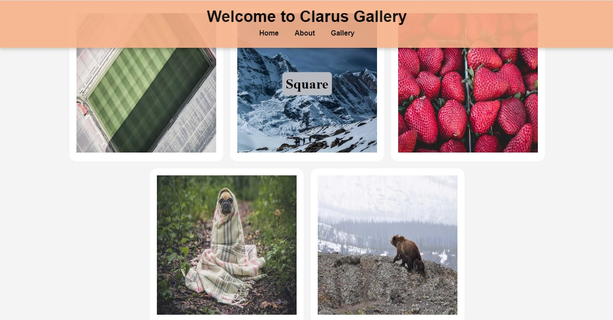

# ClarusGallery

Clarus Gallery is a simple and elegant image gallery. This project provides a web page that displays various images and displays description text when you hover over each image.

## Features

- A stylish and minimalist design
- Tooltip that shows the description text when you hover over the images
- Responsive and modern user
-
- # Clarus Gallery

Clarus Gallery, basit ve şık bir resim galerisidir. Bu proje, çeşitli resimleri gösteren ve her resmin üzerine geldiğinizde açıklama metnini gösteren bir web sayfası sunar.

## Özellikler

- Şık ve minimalist bir tasarım
- Resimler üzerine geldiğinizde açıklama metnini gösteren tooltip
- Duyarlı ve modern kullanıcı arayüzü
  

[Canlı Demo'yu Deneyin](https://fatihycan.github.io/clarus-image/)
